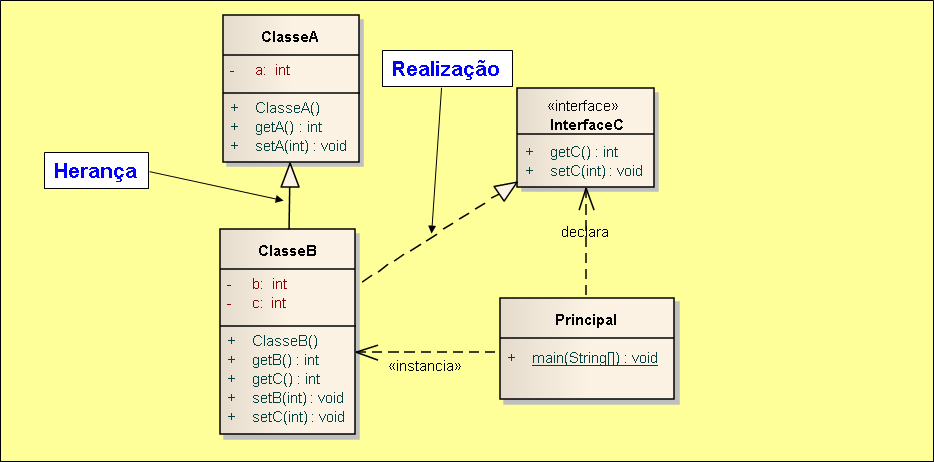

# Exemplo de implementação de relacionamento realização e herança em Java.

## Contextualização

- Programa em Java que demostra a implementação do relacionamento realização e herança. 
- É um relacionamento semântico entre classificadores, no qual um dos classificadores especifica um contrato cujo comprimento é assegurado pelo outro classificador. 
- É representada graficamente por uma linha tracejada com uma grande seta vazia apontando para o classificador que especifica o contrato. 
- Semanticamente, a realização é algo entre a dependência e a generalização(herança) e sua notação é um combinado das notações destes dois tipos. 
- O projeto foi desenvolvido no NetBeans deve ser chamado relacionamento_uml_realizacao_java. 
- Utiliza o Apache Maven para a automatização da construção. 

## Diagrama de classes

## Arquivo do projeto

O arquivo Modelo.EAP é o projeto do sistema utilizando ferramanta CASE Enterprise Arquitect.

## Outros arquivos

- pom.xml - Arquivo de configuração da ferramenta de automação Maven.
- *.bat - Arquivos de lote(Batch) de console para tarefas compilar, executar, documentar, empacotar e limpar o projeto.